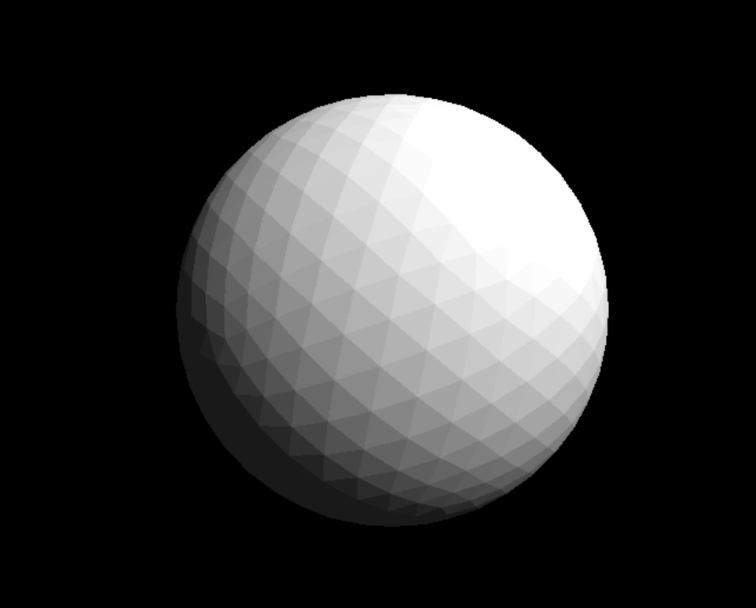
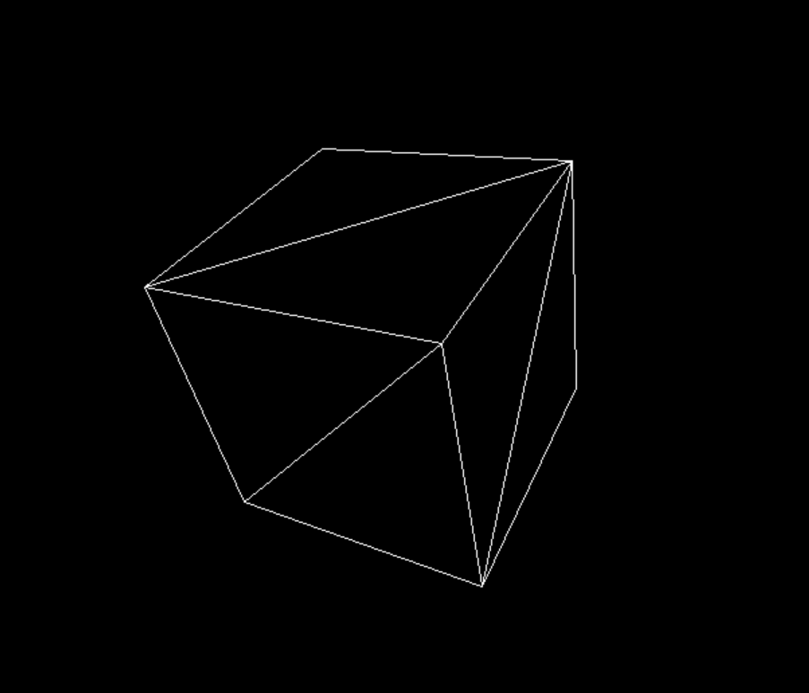

# SoftRenderer

This is a simple 3D renderer written in C++ just for fun, I use EazyX lib to create window and output render results.

It has a massive performance issue because I just use a simple and direct way to render.

After read the .obj file, it will show a model at screen, you can use WASD to move and IJKL to rotate.

Cube will rotate each frame.

### Known Issues

Pixels will appear on the opposite side when they go beyond the screen boundaries.

### Screenshots

ad

